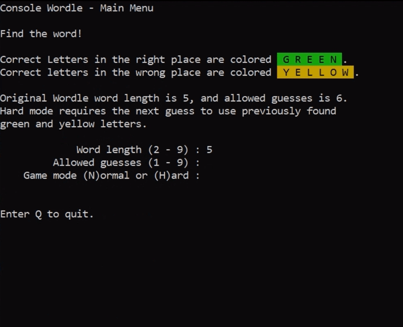

# Kondle
A console Wordle clone.

## Description

The game plays exactly like the original Wordle game, hard mode included, but the word length and maximum number of guesses are player selectable.

Words are picked at random from the words.txt file. This list is not curated, so the word that needs to be guessed is random. It contains plurals, profanity, etc. The list can be substituted or edited as desired. Kondle removes special characters, and will only pick those of length specified by the player.

## Technology
* C++20
* Modules

## Build
This was built with MS Visual Studio. Make sure the Modules experimental feature is enabled, do not enable ASAN, and install gsl-lite. No platform specific libraries were used for this, so if you're on a platform other than Windows and your tools support C++20 features, you should be able to build this.

## How to play
Upon launching the game, you are greeted with the main menu. The rules are briefly described here, and the player can enter the word length, number of allowed guesses, and choose normal or hard mode. The original Wordle game uses 5 and 6 for word length and allowed guesses, respectively. Hit enter after each option to confirm. The game will start immediately afterwards. Guess a word and follow the hints after each guess to guide you to the winning word!
Enter Q at any point during the game or main menu to exit.

Please note that increasing the word length and number of guesses may cause formatting issues, as the number of rows or columns can exceed the size of the terminal window. The game was primarily tested on a 30x130 size terminal.

## Author
Created by Martijn Koning.
